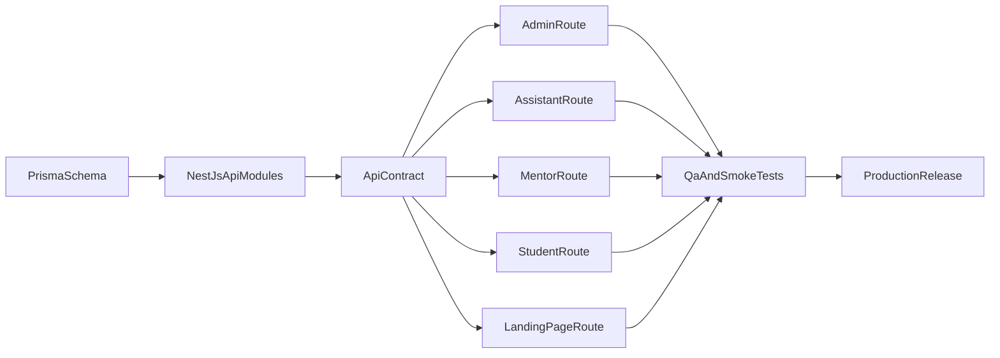

# Workplan Unicorns Edu 5.0 (8 Tuần)

## 1) Bối cảnh và mục tiêu

Unicorns Edu 5.0 đang chuyển từ PoC sang production trên monorepo Turborepo (`apps/web`, `apps/api`) với nền tảng Prisma + PostgreSQL đã có schema rõ ràng theo domain. Mục tiêu của kế hoạch này là hoàn thiện bản chạy production trong 8 tuần, ưu tiên độ đúng của dữ liệu tài chính/phân quyền và tốc độ triển khai giao diện theo route.

Mục tiêu cụ thể:
- Hoàn thiện backend cốt lõi tại `apps/api` cho Auth, Learning, Finance, Lesson, Assistant, Content.
- Hoàn thiện frontend tại `apps/web` cho các route `/admin`, `/assistant`, `/mentor`, `/student`, `/landing-page`.
- Thiết lập nhịp delivery có đo lường được (DoD/KPI theo tuần), đủ điều kiện launch tuần 8.

## 2) Phạm vi và nguyên tắc triển khai

Phạm vi trong 8 tuần:
- Xây mới các luồng core theo schema hiện tại (không mở rộng schema lớn nếu chưa có yêu cầu sản phẩm rõ).
- Tập trung vào tính đúng nghiệp vụ hơn là tối ưu sớm.
- Kiểm thử trọng tâm ở phân quyền và dòng tiền.

Nguyên tắc:
- FE/BE phát triển song song theo mô hình contract-first (không chờ backend xong mới làm frontend).
- Không merge tính năng thiếu API contract hoặc thiếu test tối thiểu cho luồng nhạy cảm.
- Route nào mở cho production thì phải có smoke test truy cập theo role.
- Chốt sớm chiến lược route: giữ route phẳng theo feature hay chuyển sang nhóm persona (`/admin`, `/assistant`, `/mentor`, `/student`) để tránh vừa làm vừa đổi kiến trúc.

## 2.1) Chiến lược Mock-data để FE/BE song song

Mục tiêu:
- Cho frontend triển khai sớm UI/UX và flow nghiệp vụ trước khi backend hoàn thiện toàn bộ endpoint.
- Giảm tắc nghẽn giữa team bằng cách thống nhất contract từ đầu.

Nguyên tắc mock:
- Contract-first: mock response phải bám schema DTO/API contract đã chốt.
- Toggle rõ ràng theo môi trường (ví dụ `USE_MOCK_DATA=true` ở local/dev frontend), không dùng mock ở staging/prod.
- Mock theo scenario nghiệp vụ, không chỉ happy-path (bao gồm empty/loading/error/permission denied).
- Mỗi mock dataset phải có owner và ngày hết hạn; mốc mặc định de-mock là tuần 7.

Deliverable bắt buộc:
- Tạo `mock contract pack` cho 5 route mục tiêu: `/admin`, `/assistant`, `/mentor`, `/student`, `/landing-page`.
- Tạo mapping bảng theo route: `mock field` <-> `API field` để tránh lệch tên/kiểu dữ liệu.
- Có checklist de-mock cho từng route (điểm nào đã dùng API thật, điểm nào còn mock).

Mốc sử dụng mock:
- Tuần 1-6: frontend ưu tiên chạy bằng mock-data để phát triển song song với backend.
- Tuần 7: thực hiện integration sprint (de-mock theo route, nối API thật, xử lý mismatch contract).
- Tuần 8: toàn bộ luồng production chạy API thật, mock chỉ giữ cho test/sandbox.

## 3) Team model và trách nhiệm

### Phương (Fullstack - Architect/Backend Lead)
- Owner kiến trúc backend, schema/migration Prisma, chuẩn API contract.
- Triển khai logic Auth, Finance, Payroll, Revenue, phân quyền theo `UserRole`.
- Thiết lập quality gate: code review module nhạy cảm, tiêu chuẩn test backend.

### Huy (Frontend - Product Flow)
- Owner luồng UI/UX các route nội bộ (`/admin`, `/mentor`) và tích hợp API.
- Chuẩn hóa layout, state handling, form behavior, error handling phía web.

### Minh (Frontend - UX/Landing + Assistant/Student)
- Owner `/landing-page`, `/assistant`, `/student` và trải nghiệm người dùng.
- Tối ưu tương tác, feedback trạng thái, thông báo thao tác thành công/lỗi.

Quy tắc phối hợp:
- Backend publish API contract trước khi frontend binding.
- Frontend phản hồi sớm các mismatch payload/status code trong ngày.
- PR liên quan finance/auth bắt buộc có review của Phương trước merge.

## 4) Lộ trình 8 tuần (2-3-2-1, có checkpoint 0.5)

### Checkpoint 0.5 (3-5 ngày đầu tuần 1) - Domain reconciliation
Scope:
- Rà soát logic thực tế từ bản 3.9 trước khi mở rộng feature mới.

Deliverables:
- Tài liệu source-of-truth cho số liệu tài chính (`payments`, `wallet_transactions`, `revenue`, payroll liên quan attendance/session).
- Ma trận phân quyền chuẩn hóa `route x role x action` (bao gồm role phụ nếu có).
- Danh sách migration inventory từ 3.9 và thứ tự chạy thử trên staging.

Definition of Done:
- Team thống nhất một mô hình dòng tiền chuẩn (ledger/reconciliation) cho 5.0.
- Team thống nhất mô hình route mục tiêu để tránh mismatch giữa kế hoạch và hiện trạng 3.9.
- Có checklist migration rehearsal dùng lại được ở tuần 6 và tuần 8.

## Phase 1 - Nền móng và Core API (Tuần 1-2)

### Tuần 1 - Setup hệ thống và Auth
Scope:
- Khởi tạo chuẩn làm việc backend/frontend theo monorepo.
- Xây dựng Auth + Role guard nền tảng.

Deliverables:
- `apps/api`: cấu trúc module cơ bản, kết nối Prisma, migration baseline.
- API Auth: login/logout/me, guard theo `UserRole` (`admin`, `teacher`, `student`, `assistant`, `visitor`).
- `apps/web`: khung app, layout chung, trang login/logout, xử lý session cơ bản.
- Draft giao diện landing page (wireframe + content blocks).
- Mock-data layer đầu tiên cho frontend (auth profile, dashboard summary, landing content).

Definition of Done:
- Đăng nhập thành công theo role; route trái quyền bị chặn.
- Migration chạy ổn định trên local và staging DB.
- Không còn hỗ trợ plaintext password trong bất kỳ luồng đăng nhập/cập nhật tài khoản.
- 100% mutation endpoint quan trọng có test phân quyền mức route + role.
- Frontend có thể chạy end-to-end bằng mock cho các route chưa có API, không bị block bởi backend.
- Contract Auth giữa FE/BE đã khóa version để đảm bảo de-mock an toàn ở tuần 7.

### Tuần 2 - Learning và quản lý nhân sự lớp
Scope:
- Hoàn thiện API Learning + quan hệ N-N lớp-học sinh-giáo viên.
- Xây dựng CRUD cơ bản cho admin.
- Chốt route foundation theo kiến trúc mục tiêu (persona routes hoặc feature routes có alias rõ ràng).

Deliverables:
- API: `classes`, `sessions`, `attendance`, `class_teachers`, `student_classes`.
- UI `/admin`: dashboard sơ bộ, CRUD lớp, gán học sinh/giáo viên vào lớp.
- Định nghĩa state machine cho attendance (`present`, `excused`, `absent`) và tác động tài chính tương ứng.
- Route registry: mỗi route có auth mode, role truy cập, contract endpoint kèm theo.
- Mock scenario cho `/admin`: class list rỗng, class nhiều học sinh, lỗi quyền truy cập, lỗi validate.

Definition of Done:
- Admin tạo lớp, gán teacher/student, mở session và ghi attendance thành công.
- Kiểm tra dữ liệu quan hệ N-N không sinh bản ghi trùng.
- Attendance update có test idempotency (ghi lại cùng dữ liệu không làm lệch số dư/phiên học).
- Frontend `/admin` hoàn thiện bằng mock và có checklist de-mock theo từng màn hình/endpoint.

## Phase 2 - Chuyên môn hóa theo route (Tuần 3-5)

### Tuần 3 - Route `/mentor` + Lesson + Payroll/Bonus
Scope:
- Phát triển API Lesson và luồng giáo viên.
- Bổ sung nghiệp vụ lương/thưởng gắn với giáo viên.

Deliverables:
- API Lesson: `lesson_plans`, `lesson_tasks` (và quan hệ cần thiết).
- API `payroll`, `bonuses` bản đầu.
- UI `/mentor`: xem lớp phụ trách, session, điểm danh, ghi chú buổi học.
- Mock scenario cho `/mentor`: lớp không có session, session đã khóa, lỗi phân quyền theo lớp.

Definition of Done:
- Giáo viên xem đúng dữ liệu theo lớp được phân công.
- Attendance và lesson notes lưu được, truy xuất lại nhất quán.
- Payroll/bonus tạo được bản ghi với validation cơ bản.
- Frontend `/mentor` hoàn thiện flow bằng mock-data bám đúng contract để sẵn sàng nối API ở tuần 7.

### Tuần 4 - Route `/assistant` + Finance
Scope:
- Hoàn thiện luồng thu học phí và giao dịch liên quan.
- Tập trung UX thao tác nhanh, ít lỗi nhập liệu.
- Chuẩn hóa reconciliation giữa dashboard và nguồn dữ liệu giao dịch.

Deliverables:
- API Finance: `payments`, `wallet_transactions`, `revenue`.
- API Assistant: `assistant_tasks`, `assistant_payments`.
- UI `/assistant`: thu phí, cập nhật trạng thái (`paid`, `unpaid`, `deposit`), xem task.
- Bảng đối soát chuẩn `ledger vs dashboard vs balances` cho dữ liệu mẫu.
- Mock scenario tài chính kiểm soát được cho test UX: chậm phản hồi, lỗi cập nhật trạng thái, lệch số dư.

Definition of Done:
- Luồng thu phí chạy end-to-end từ UI -> API -> DB.
- Báo cáo revenue cập nhật đúng sau thao tác payment.
- Trợ giảng không truy cập được dữ liệu admin/mentor trái quyền.
- Multi-table finance mutation chạy trong transaction boundary rõ ràng.
- Đối soát dữ liệu mẫu không còn sai lệch.
- Frontend `/assistant` hoàn chỉnh bằng mock scenario nhạy cảm và có test contract cho mutation payload.

### Tuần 5 - Route `/student`
Scope:
- Cung cấp portal học sinh cho lịch học, tài liệu và lịch sử đóng tiền (read-only phần tài chính).

Deliverables:
- API học sinh: profile, timetable, payment history, documents.
- UI `/student`: lịch học, tài liệu, cập nhật thông tin cá nhân.
- De-mock plan cho toàn bộ route còn lại trước tuần 7.

Definition of Done:
- Học sinh chỉ thấy dữ liệu của chính mình.
- Dữ liệu payment chỉ đọc, không có thao tác ghi từ route học sinh.
- Frontend `/student` hoàn thiện bằng mock và khóa contract response trước integration tuần 7.

## Phase 3 - Vibe, hiệu năng, tích hợp FE-BE (Tuần 6-7)

### Tuần 6 - Hoàn thiện `/landing-page` và tối ưu API
Scope:
- Đẩy chất lượng giao diện public và tối ưu truy cập dashboard.
- Chạy rehearsal migration sớm, không chờ đến tuần 8.

Deliverables:
- `/landing-page` hoàn chỉnh dựa trên `home_posts`, `categories` (`intro`, `news`, `docs`, `policy`).
- Cải thiện truy vấn/tổng hợp dữ liệu admin; tận dụng `dashboard_cache` khi phù hợp.
- Dry-run migration trên dữ liệu staging clone + báo cáo kiểm tra trước/sau.

Definition of Done:
- Landing page hiển thị đúng dữ liệu content động.
- Dashboard load ổn định ở mức chấp nhận được trên dữ liệu test.
- Hoàn thành ít nhất 2 lần migration rehearsal thành công, có log và kiểm tra checksum/row-count.

### Tuần 7 - Kiểm thử tích hợp nghiệp vụ
Scope:
- Integration sprint: nối frontend mock sang backend API thật cho tất cả route.
- Rà soát tính đúng các luồng chéo backend-frontend sau de-mock.

Deliverables:
- De-mock hoàn tất cho `/admin`, `/assistant`, `/mentor`, `/student`, `/landing-page`.
- Checklist xác thực dòng tiền: `/assistant` -> `payments` -> `revenue` -> `dashboard_cache`.
- Checklist xác thực dòng việc trợ giảng: `assistant_tasks` liên kết lesson đúng.
- Danh sách mismatch contract và bản vá FE/BE tương ứng.
- Fix các lỗi blocking trước launch.

Definition of Done:
- 100% route production chuyển sang API thật, không còn phụ thuộc mock runtime.
- Không còn lỗi blocking trên luồng tiền/phân quyền.
- UAT nội bộ đạt tối thiểu 90% checklist pass.

## Phase 4 - Launching (Tuần 8)

Scope:
- Chốt chất lượng, migrate dữ liệu từ PoC, go-live production.

Deliverables:
- Kịch bản migrate dữ liệu + rollback plan.
- Regression test phân quyền toàn hệ thống.
- Deploy production + smoke test sau deploy.

Definition of Done:
- Dữ liệu migrate đạt đối soát mẫu.
- Role access đúng cho toàn bộ route.
- Hệ thống hoạt động ổn định sau phát hành.

## 5) Route-to-domain map (Backend/Frontend)

| Route | Người dùng | Chức năng chính | Domain/Bảng liên quan |
| --- | --- | --- | --- |
| `/admin` | Admin | Quản lý lớp, nhân sự lớp, tổng quan doanh thu | `users`, `classes`, `sessions`, `attendance`, `revenue`, `dashboard_cache` |
| `/assistant` | Assistant | Thu phí, cập nhật trạng thái, theo dõi task | `payments`, `wallet_transactions`, `assistant_tasks`, `assistant_payments` |
| `/mentor` | Teacher | Dạy học, điểm danh, giáo án, lương/thưởng | `lesson_plans`, `lesson_tasks`, `sessions`, `attendance`, `payroll`, `bonuses` |
| `/student` | Student | Lịch học, tài liệu, lịch sử đóng tiền (read-only) | `student_classes`, `documents`, `payments` |
| `/landing-page` | Public | Giới thiệu, tin tức, tài liệu, chính sách | `home_posts`, `categories` |

## 6) KPI/DoD toàn dự án

- Velocity: mỗi tuần hoàn thành >= 80% commit scope đã chốt đầu tuần.
- Chất lượng:
  - 100% API auth/finance có test tối thiểu cho case thành công + case trái quyền.
  - 0 lỗi mức critical còn mở khi vào tuần 8.
- Tích hợp:
  - 100% route production dùng API thật (không mock).
  - 100% route có smoke test truy cập theo role.
  - 100% mock endpoint có contract test và deadline de-mock được theo dõi.
- Vận hành:
  - Migration có checklist pre/post và rollback rõ ràng.
  - 100% mutation tài chính nhiều bảng có transaction boundary.
  - Có báo cáo reconciliation cho mẫu dữ liệu migrate trước go-live.

## 7) Risk register và ứng phó

| Rủi ro | Mức độ | Owner | Ứng phó |
| --- | --- | --- | --- |
| Trễ API backend làm nghẽn frontend | Cao | Phương | Chốt API contract sớm; ưu tiên endpoint critical trước; daily sync blocker |
| Sai lệch logic tiền (payment/revenue/payroll) | Rất cao | Phương | Viết test nghiệp vụ trọng điểm; đối soát dữ liệu mẫu hàng tuần |
| Frontend over-engineer, trễ timeline | Trung bình | Huy/Minh | Ưu tiên chức năng trước hiệu ứng; khóa scope tuần bằng DoD |
| Nợ test tích tụ cuối kỳ | Cao | Cả team | Áp ngưỡng test tối thiểu theo tuần; không dồn test sang tuần 8 |
| Lệch contract giữa FE/BE | Trung bình | Huy/Minh + Phương | Dùng schema response chuẩn; review payload trước khi merge |
| Thiếu CI pipeline bắt lỗi sớm | Rất cao | Phương | Thiết lập pipeline bắt buộc (build/lint/test/smoke), chặn merge khi fail |
| Drift migration giữa môi trường do chạy tay | Rất cao | Phương | Chốt migration manifest, rehearsal trên staging clone, kiểm tra schema trước release |
| Thiếu monitoring/alert khi go-live | Cao | Cả team | Bật error monitoring, alert 5xx/auth/db, chuẩn hóa incident runbook |
| Rollback không đủ nhanh khi migration lỗi | Cao | Phương | Chuẩn hóa rollback app+schema+data, diễn tập có timebox trước launch |
| Mock-data lệch contract gây vỡ tích hợp cuối kỳ | Cao | Huy/Minh + Phương | Áp contract-first, có mapping field và contract test cho tất cả mock |

## 8) Cadence làm việc

- Daily 15 phút: cập nhật tiến độ, blocker, thay đổi scope.
- Weekly planning (đầu tuần): chốt scope + DoD tuần.
- Weekly demo/review (cuối tuần): demo end-to-end các luồng đã xong.
- Quy tắc PR:
  - Module auth/finance bắt buộc review bởi Phương.
  - Không merge khi thiếu tiêu chí DoD tuần.

## 9) Checklist Launch tuần 8

- Chốt migration manifest theo thứ tự chạy, owner và môi trường áp dụng.
- Hoàn tất migrate dữ liệu từ PoC sang schema mới.
- Chạy preflight schema assertions (cột/constraint/index bắt buộc) trước mở traffic.
- Chạy regression role access cho `/admin`, `/assistant`, `/mentor`, `/student`.
- Đối soát ngẫu nhiên dữ liệu payment/revenue/payroll sau migrate.
- Chạy smoke test tự động theo role cho toàn bộ route production.
- Diễn tập rollback app + DB, xác nhận thời gian phục hồi trong ngưỡng chấp nhận.
- Kiểm tra env parity staging/prod cho biến quan trọng (JWT, CORS, DB, secrets).
- Xác nhận logging, error monitoring, backup DB và rollback script sẵn sàng.
- Chốt tiêu chí go/no-go (không còn lỗi critical, migration pass, smoke pass).
- Deploy production và hoàn thành smoke test sau deploy.

## 10) Sơ đồ phối hợp triển khai

