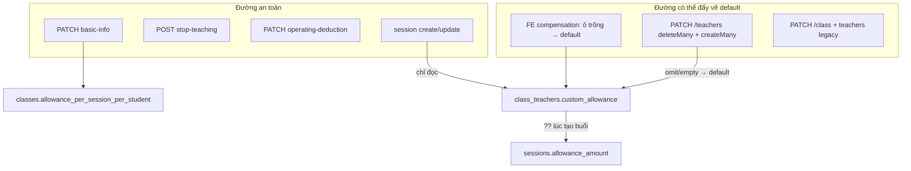

# Review: trợ cấp gia sư trong lớp bị fallback về mặc định lớp

Date: 2026-07-20

## Tóm tắt

Gia sư có trợ cấp riêng theo lớp (`class_teachers.custom_allowance`) đôi khi “bỗng dưng” về đúng trợ cấp mặc định của lớp (`classes.allowance_per_session_per_student`).

**Constraint từ báo cáo thực tế**

1. Gia sư vẫn **đang dạy (active)** — không liên quan nghỉ dạy / đổi `status`.
2. Lỗi cũng xảy ra với lớp **chỉ có 1 gia sư** — không cần giả thuyết “sửa A làm mất custom B”.

**Hệ quả thu hẹp nguyên nhân**

| Giả thuyết | Còn hợp lệ? |
|------------|-------------|
| Compensation C1: sửa T1 làm materialize T2 | **Không bắt buộc** — vẫn có thể xảy ra ở lớp ≥2, nhưng **không giải thích** case 1 gia sư |
| Roster/compensation đè **chính** gia sư đó (ô trống / omit / no-op materialize) | **Còn — ưu tiên cao** |
| Historical basic-info sync đã ghi đè custom = default | **Còn** |
| `custom_allowance IS NULL` inherit khi đổi default lớp | **Còn** |
| Nghỉ dạy / re-add | **Loại khỏi symptom chính** |

**Kết luận chính**

| Hạng mục | Kết luận |
|----------|----------|
| `PATCH /class/:id/basic-info` đổi default lớp | **Đã an toàn** — không còn ghi đè `custom_allowance` của từng gia sư |
| Nguyên nhân live (kể cả lớp 1 GS) | Lưu **roster** hoặc **compensation** trên chính gia sư đó — ô trống / omit → ghi default lớp đè override |
| Nghỉ dạy / re-add / đụng nhầm GS khác | Side-risk hoặc case ≥2 GS; **không** giải thích đủ case 1 GS |
| Payroll / dashboard | Không đọc lại `custom_allowance`; tin số đã snapshot trên buổi học |

---

## Mô hình dữ liệu (hiện tại — hybrid, dễ nhầm)

| Layer | Ý nghĩa |
|--------|---------|
| `classes.allowance_per_session_per_student` | Trợ cấp mặc định của lớp (VNĐ / HS / buổi) |
| `class_teachers.custom_allowance` | Override theo cặp gia sư–lớp; **nullable** |
| Session resolve | `null` = **inherit** default lớp: `custom ?? classDefault` |
| `PATCH .../teachers` (hiện tại) | Field omit → **copy** default lớp vào row (không giữ `null`) |
| `PATCH .../basic-info` (hiện tại) | Chỉ đổi bảng `classes`; **không** đụng `custom_allowance` |



---

## File / endpoint liên quan

| Vai trò | Vị trí |
|---------|--------|
| Schema | `apps/api/prisma/schema/learning.prisma` |
| BE roster | `ClassService.updateClassTeachers` — `PATCH /class/:id/teachers` |
| BE basic-info | `ClassService.updateClassBasicInfo` — `PATCH /class/:id/basic-info` |
| BE compensation | `ClassService.updateClassTeacherCompensation` — `PATCH /class/:id/teacher-compensation` |
| Resolve rate buổi | `apps/api/src/session/session-allowance.util.ts` |
| FE roster | `apps/web/components/admin/class/EditClassTeachersPopup.tsx` |
| FE compensation | `apps/web/components/admin/class/EditClassTeacherCompensationPopup.tsx` |
| FE basic-info | `apps/web/components/admin/class/EditClassBasicInfoPopup.tsx` |
| FE hiển thị | `apps/web/components/admin/class/TutorCard.tsx` |

---

## Kết quả quét (5 hướng)

### 1. Backend ghi `custom_allowance`

- **basic-info fix đã có trong code:** không còn `updateMany` sync mọi gia sư về default. Test: `class.service.spec.ts` (“updates class default allowance without overwriting teacher custom_allowance”).
- **`updateClassTeachers` (HIGH):**  
  `customAllowance = teacher.custom_allowance ?? defaultAllowance`  
  rồi `deleteMany` toàn bộ `class_teachers` của lớp → `createMany`.  
  Mọi lần Lưu roster đều rewrite; omit/empty → default lớp.
- Legacy `PATCH /class` + `teachers`: omit → `null` (inherit hiệu dụng khi tính buổi) — API còn, FE chính không dùng.
- `endClass` / `stopClassTeacher` / staff inactive / schedule / students: **không** ghi `custom_allowance`.

### 2. Session / payroll

- Payroll/dashboard **không** `COALESCE(custom_allowance, class_default)` — chỉ dùng `sessions.allowance_amount`.
- Fallback `custom ?? default` chỉ lúc **tạo buổi / preview**.
- Session **không** ghi ngược vào `class_teachers`.
- Bug riêng (khác symptom): đổi gia sư trên buổi + điểm danh có thể giữ snapshot rate cũ.

### 3. Frontend

- Basic-info FE: chỉ gửi field lớp — **an toàn** với BE hiện tại.
- `EditClassTeachersPopup`: ô trống → gửi `custom_allowance = defaultAllowance`.
- `EditClassTeacherCompensationPopup`: ô trống → `parseMoneyInput(...) ?? classDefault ?? 0` cho **mọi** gia sư khi Lưu (kể cả no-op / chỉ sửa một người).
- Admin và staff (assistant/accountant) dùng chung page class detail → cùng hành vi.
- `TutorCard`: khi DB `null` vẫn **hiển thị** default dưới nhãn “Trợ cấp” (dễ nhầm với override thật).

### 4. Schema / migration / docs

- Không migration nào backfill/wipe `custom_allowance`.
- Damage đến từ **app write** (sync basic-info cũ + roster/compensation hiện tại).
- Docs drift: một dòng CHANGELOG cũ vẫn nói basic-info sync customs; Unreleased + `docs/pages/admin.md` khớp code hiện tại (không sync).

### 5. Vòng đời gia sư trên lớp

- Nghỉ dạy / kết thúc lớp / inactive staff: chỉ đổi `status`, **giữ** `custom_allowance`.
- Không cron/seed/calendar ghi `class_teachers`.
- Operating-deduction trên staff: **không** đụng allowance.
- Re-add sau nghỉ dạy đi qua roster replace → có thể mất custom (**không** phải case đang báo).

---

## Ranking nguyên nhân (tutor ACTIVE + lớp có thể chỉ 1 GS)

1. **Live CRITICAL — lưu roster trên chính gia sư đó**  
   `PATCH /teachers` + FE/BE điền default khi omit/ô trống → đè override. Xảy ra với **1 GS** nếu clear ô trợ cấp, hoặc state mất custom rồi Lưu (kể cả chỉ đổi % vận hành / no-op nếu payload không gửi lại số cũ).

2. **Live CRITICAL — popup compensation trên chính gia sư đó**  
   Clear ô / placeholder “Để trống = mặc định lớp” → ghi default vào `custom_allowance`. No-op Lưu với ô trống cũng materialize. **Đủ giải thích lớp 1 GS.**

3. **Historical (code đã fix, DB có thể đã hỏng)**  
   Basic-info từng `updateMany` mọi `custom_allowance` = default (kể cả lớp 1 GS). Data cũ vẫn hiện “đang dạy mà về default”.

4. **Product confusion — `custom_allowance IS NULL`**  
   Inherit: đổi default lớp → TutorCard/buổi mới theo default dù GS vẫn active. Lớp 1 GS vẫn đúng mô hình này.

5. Side-risk: nghỉ dạy / re-add; materialize “đụng nhầm T2” ở lớp ≥2 — **không** cần để giải thích case 1 GS.

6. Session teacher-swap snapshot stale (sai rate buổi, không rewrite `class_teachers`).

---

## Evidence code (điểm nguy hiểm)

### BE — roster fill default + deleteMany

```ts
// apps/api/src/class/class.service.ts — updateClassTeachers
customAllowance: teacher.custom_allowance ?? defaultAllowance,
// ...
await tx.classTeacher.deleteMany({ where: { classId: id } });
await tx.classTeacher.createMany({ /* ... customAllowance, status: 'active' */ });
```

### FE — roster gửi default khi trống

```ts
// EditClassTeachersPopup.tsx
...(t.customAllowance != null
  ? { custom_allowance: t.customAllowance }
  : defaultAllowance != null
    ? { custom_allowance: defaultAllowance }
    : {}),
```

### FE — compensation materialize default

```ts
// EditClassTeacherCompensationPopup.tsx
custom_allowance:
  parseMoneyInput(allowances[teacher.id] ?? "") ??
  classDetail.allowancePerSessionPerStudent ??
  0,
```

### BE — basic-info hiện an toàn

Chỉ `tx.class.update` với `allowancePerSessionPerStudent`; **không** gọi `classTeacher.updateMany` để sync allowance.

---

## Hướng sửa đã chọn (**đã implement — 2026-07-26**)

**Preserve-on-omit + soft-merge roster** — cùng tinh thần fix basic-info: không phá override đã lưu.

1. **BE `updateClassTeachers`**
   - Bỏ `deleteMany` toàn bảng.
   - Upsert theo `teacher_id`: omit `custom_allowance` → **giữ** giá trị hiện có; row mới omit → `null` (inherit), không copy default.
   - Teacher bị bỏ khỏi list active → soft `inactive`, không hard-delete.

2. **FE**
   - Roster: không inject `defaultAllowance` khi ô trống; omit = preserve/inherit theo BE.
   - Compensation: chỉ gửi teachers đã chỉnh; tránh no-op materialize cả lớp.
   - TutorCard: phân biệt nhãn “mặc định lớp” vs override.

3. **Tests + docs**  
   Spec preserve; cập nhật `docs/pages/admin.md`, `docs/Database Schema.md`, CHANGELOG.

**Out of scope lần fix này:** session teacher-swap snapshot; deprecate legacy `PATCH /class`; script repair data cũ (làm riêng nếu cần).

---

## Kịch bản test thủ công

### Setup

- Role: `admin` / `assistant` (roster + basic-info); `accountant_expense` cho popup trợ cấp.
- **Ưu tiên reproduce trên lớp đúng 1 gia sư active (T1)** — khớp báo cáo thực tế.
- (Tùy chọn) lớp 2 GS để regression C1 “đụng nhầm T2”.
- Default lớp: **100.000** VNĐ/HS.
- Set T1 custom = **180.000**.
- Xác minh: Network `GET /class/:id` → `teachers[].customAllowance`, hoặc:

```sql
SELECT teacher_id, custom_allowance, status
FROM class_teachers
WHERE class_id = '...';
```

### A. Basic-info (đã fix — kỳ vọng PASS ngay)

| ID | Bước | Kỳ vọng hiện tại |
|----|------|------------------|
| A1 | Đổi default lớp 100k → 90k, Lưu | T1 vẫn **180k**; default lớp = 90k |
| A2 | Tạo buổi mới với T1 | Dùng **180k**/HS |
| A3 | T2 `custom = null` → tạo buổi T2 | Dùng **90k** (inherit) |

### B. Roster — ưu tiên reproduce (tutor vẫn active)

| ID | Bước | Kỳ vọng hiện tại (bug) | Sau fix |
|----|------|------------------------|---------|
| B1 | Mở Chỉnh sửa gia sư, không đổi, Lưu | Thường giữ 180k nếu FE re-send; vẫn rewrite row | Preserve |
| B2 | **Xóa trống** ô trợ cấp T1 rồi Lưu (vẫn active) | T1 → **100k** | Không silent-reset về default |
| B3 | Thêm T3, để trống trợ cấp; không đụng ô T1 | T3 = copy default; T1 phụ thuộc FE re-send | T1 giữ; T3 = `null` inherit |
| B4 | Chỉ đổi % vận hành / thêm bớt người khác | Rủi ro mất state T1 → gửi default | Custom T1 giữ |

### C. Compensation popup

| ID | Bước | Kỳ vọng hiện tại (bug) | Sau fix |
|----|------|------------------------|---------|
| C1 | T2 trống; chỉ sửa T1 hoặc % vận hành, Lưu | T2 bị ghi default | Chỉ teacher đã chỉnh đổi |
| C2 | Clear ô T1 (180k) rồi Lưu | T1 → default | Explicit inherit/`null`, không silent default |
| C3 | Mở popup, Lưu ngay (no-op) | Materialize default các ô trống | Không đổi DB |

### E. Inherit vs “tưởng lock” (không phải bug write)

| ID | Bước | Kỳ vọng |
|----|------|----------|
| E1 | T2 `NULL`; đổi default 100k → 120k | T2 theo 120k — **đúng inherit** |
| E2 | T1 = 180k sau đổi default | Không đổi — **override** |

### F. Session (bug riêng — không phải fallback `class_teachers`)

| ID | Bước | Kỳ vọng hiện tại |
|----|------|-------------------|
| F1 | Đổi gia sư buổi + attendance, không override | Có thể giữ rate snapshot cũ |
| F2 | Override trợ cấp buổi; sửa điểm danh không gửi lại override | Override có thể bị tính lại từ snapshot |

### G. Control an toàn

| ID | Bước | Kỳ vọng |
|----|------|----------|
| G1 | Đổi lịch / học sinh | `custom_allowance` không đổi |
| G2 | Chỉ PATCH % vận hành trên staff detail | `custom_allowance` không đổi |

### Checklist QA ưu tiên (lớp 1 GS, đang dạy)

1. A1–A2 (basic-info không đè T1)  
2. B2, B4 (roster trên chính T1)  
3. C2, C3 (compensation trên chính T1)  
4. E2 (T1 override giữ khi đổi default); nếu muốn test inherit dùng T1 `NULL` riêng  
5. (Tùy chọn lớp ≥2) C1

---

## Báo cáo hoàn tất (review-only)

| Mục | Nội dung |
|-----|----------|
| Thay đổi code | Không (chỉ thêm tài liệu research này) |
| Phạm vi | Quét BE/FE/schema/session/lifecycle liên quan trợ cấp gia sư–lớp |
| Verify | Review tĩnh + 5 hướng song song; chờ QA thủ công theo bảng A/B/C |
| Docs | File này: `docs/researches/2026-07-20-tutor-class-allowance-fallback-review.md` |
